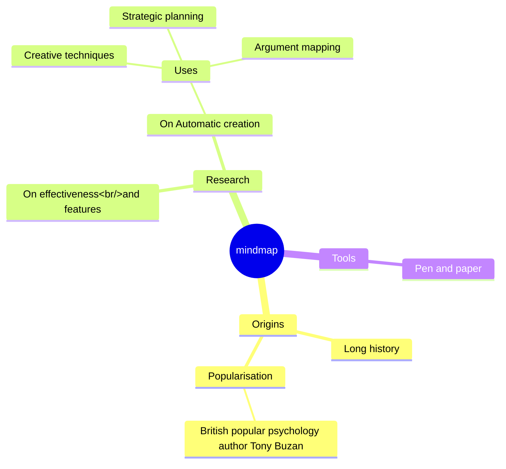

# 扩展 Shortcode - Mermaid


{{&lt; version 0.2.15 changed &gt;}}

`mermaid` shortcode 使用 [Mermaid](https://mermaidjs.github.io/) 库提供绘制图表和流程图的功能。

&lt;!--more--&gt;

[mermaid](https://mermaidjs.github.io/) 是一个可以帮助你在文章中绘制图表和流程图的库, 类似 Markdown 的语法。

只需将你的 mermaid 代码插入 `mermaid` shortcode 中即可。

{{&lt; admonition tip &gt;}}
你可以在 `config.toml` 中通过 `params.mermaid` 参数全局配置 mermaid 的主题
{{&lt; /admonition &gt;}}

## 流程图 {#flowchart}

一个 **流程图** `mermaid` 示例:

```markdown
{{&lt;/* mermaid */&gt;}}
graph LR;
    A[Hard edge] --&gt;|Link text| B(Round edge)
    B --&gt; C{Decision}
    C --&gt;|One| D[Result one]
    C --&gt;|Two| E[Result two]
{{&lt;/* /mermaid */&gt;}}
```

呈现的输出效果如下:

{{&lt; mermaid &gt;}}
graph LR;
    A[Hard edge] --&gt;|Link text| B(Round edge)
    B --&gt; C{Decision}
    C --&gt;|One| D[Result one]
    C --&gt;|Two| E[Result two]
{{&lt; /mermaid &gt;}}

## 时序图 {#sequence-diagram}

一个 **时序图** `mermaid` 示例:

```markdown
{{&lt;/* mermaid */&gt;}}
sequenceDiagram
    participant Alice
    participant Bob
    Alice-&gt;&gt;John: Hello John, how are you?
    loop Healthcheck
        John-&gt;John: Fight against hypochondria
    end
    Note right of John: Rational thoughts &lt;br/&gt;prevail...
    John--&gt;Alice: Great!
    John-&gt;Bob: How about you?
    Bob--&gt;John: Jolly good!
{{&lt;/* /mermaid */&gt;}}
```

呈现的输出效果如下:

{{&lt; mermaid &gt;}}
sequenceDiagram
    participant Alice
    participant Bob
    Alice-&gt;&gt;John: Hello John, how are you?
    loop Healthcheck
        John-&gt;John: Fight against hypochondria
    end
    Note right of John: Rational thoughts &lt;br/&gt;prevail...
    John--&gt;Alice: Great!
    John-&gt;Bob: How about you?
    Bob--&gt;John: Jolly good!
{{&lt; /mermaid &gt;}}

## 甘特图 {#gantt}

一个 **甘特图** `mermaid` 示例:

```markdown
{{&lt;/* mermaid */&gt;}}
gantt
dateFormat  YYYY-MM-DD
title Adding GANTT diagram to mermaid
excludes weekdays 2014-01-10

section A section
Completed task            :done,    des1, 2014-01-06,2014-01-08
Active task               :active,  des2, 2014-01-09, 3d
Future task               :         des3, after des2, 5d
Future task2              :         des4, after des3, 5d
{{&lt;/* /mermaid */&gt;}}
```

呈现的输出效果如下:

{{&lt; mermaid &gt;}}
gantt
dateFormat  YYYY-MM-DD
title Adding GANTT diagram to mermaid
excludes weekdays 2014-01-10

section A section
Completed task            :done,    des1, 2014-01-06,2014-01-08
Active task               :active,  des2, 2014-01-09, 3d
Future task               :         des3, after des2, 5d
Future task2              :         des4, after des3, 5d
{{&lt; /mermaid &gt;}}

## 类图 {#class-diagram}

一个 **类图** `mermaid` 示例:

```markdown
{{&lt;/* mermaid */&gt;}}
classDiagram
    Animal &lt;|-- Duck
    Animal &lt;|-- Fish
    Animal &lt;|-- Zebra
    Animal : &#43;int age
    Animal : &#43;String gender
    Animal: &#43;isMammal()
    Animal: &#43;mate()
    class Duck{
        &#43;String beakColor
        &#43;swim()
        &#43;quack()
    }
    class Fish{
        -int sizeInFeet
        -canEat()
    }
    class Zebra{
        &#43;bool is_wild
        &#43;run()
    }
{{&lt;/* /mermaid */&gt;}}
```

呈现的输出效果如下:

{{&lt; mermaid &gt;}}
classDiagram
    Animal &lt;|-- Duck
    Animal &lt;|-- Fish
    Animal &lt;|-- Zebra
    Animal : &#43;int age
    Animal : &#43;String gender
    Animal: &#43;isMammal()
    Animal: &#43;mate()
    class Duck{
        &#43;String beakColor
        &#43;swim()
        &#43;quack()
    }
    class Fish{
        -int sizeInFeet
        -canEat()
    }
    class Zebra{
        &#43;bool is_wild
        &#43;run()
    }
{{&lt; /mermaid &gt;}}

## 状态图 {#state-diagram}

一个 **状态图** `mermaid` 示例:

```markdown
{{&lt;/* mermaid */&gt;}}
stateDiagram-v2
    [*] --&gt; Still
    Still --&gt; [*]
    Still --&gt; Moving
    Moving --&gt; Still
    Moving --&gt; Crash
    Crash --&gt; [*]
{{&lt;/* /mermaid */&gt;}}
```

呈现的输出效果如下:

{{&lt; mermaid &gt;}}
stateDiagram-v2
    [*] --&gt; Still
    Still --&gt; [*]
    Still --&gt; Moving
    Moving --&gt; Still
    Moving --&gt; Crash
    Crash --&gt; [*]
{{&lt; /mermaid &gt;}}

## Git 图 {#git-graph}

一个 **Git 图** `mermaid` 示例:

```markdown
{{&lt;/* mermaid */&gt;}}
gitGraph
    commit
    commit
    branch develop
    checkout develop
    commit
    commit
    checkout main
    merge develop
    commit
    commit
{{&lt;/* /mermaid */&gt;}}
```

呈现的输出效果如下:

{{&lt; mermaid &gt;}}
gitGraph
    commit
    commit
    branch develop
    checkout develop
    commit
    commit
    checkout main
    merge develop
    commit
    commit
{{&lt; /mermaid &gt;}}

## 实体关系图 {#entity-relationship-diagram}

一个 **实体关系图** `mermaid` 示例:

```markdown
{{&lt;/* mermaid */&gt;}}
erDiagram
    CUSTOMER ||--o{ ORDER : places
    ORDER ||--|{ LINE-ITEM : contains
    CUSTOMER }|..|{ DELIVERY-ADDRESS : uses
{{&lt;/* /mermaid */&gt;}}
```

呈现的输出效果如下:

{{&lt; mermaid &gt;}}
erDiagram
    CUSTOMER ||--o{ ORDER : places
    ORDER ||--|{ LINE-ITEM : contains
    CUSTOMER }|..|{ DELIVERY-ADDRESS : uses
{{&lt; /mermaid &gt;}}

## 用户体验旅程图 {#user-journey}

一个 **用户体验旅程图** `mermaid` 示例:

```markdown
{{&lt;/* mermaid */&gt;}}
journey
    title My working day
    section Go to work
      Make tea: 5: Me
      Go upstairs: 3: Me
      Do work: 1: Me, Cat
    section Go home
      Go downstairs: 5: Me
      Sit down: 5: Me
{{&lt;/* /mermaid */&gt;}}
```

呈现的输出效果如下:

{{&lt; mermaid &gt;}}
journey
    title My working day
    section Go to work
      Make tea: 5: Me
      Go upstairs: 3: Me
      Do work: 1: Me, Cat
    section Go home
      Go downstairs: 5: Me
      Sit down: 5: Me
{{&lt; /mermaid &gt;}}

## 饼图 {#pie}

一个 **饼图** `mermaid` 示例:

```markdown
{{&lt;/* mermaid */&gt;}}
pie
    &#34;Dogs&#34; : 386
    &#34;Cats&#34; : 85
    &#34;Rats&#34; : 15
{{&lt;/* /mermaid */&gt;}}
```

呈现的输出效果如下:

{{&lt; mermaid &gt;}}
pie
    &#34;Dogs&#34; : 386
    &#34;Cats&#34; : 85
    &#34;Rats&#34; : 15
{{&lt; /mermaid &gt;}}

## 依赖图 {#requirement-diagram}

一个 **依赖图** `mermaid` 示例:

```markdown
{{&lt;/* mermaid */&gt;}}
requirementDiagram

requirement test_req {
id: 1
text: the test text.
risk: high
verifymethod: test
}

element test_entity {
type: simulation
}

test_entity - satisfies -&gt; test_req
{{&lt;/* /mermaid */&gt;}}
```

呈现的输出效果如下:

{{&lt; mermaid &gt;}}
requirementDiagram

requirement test_req {
id: 1
text: the test text.
risk: high
verifymethod: test
}

element test_entity {
type: simulation
}

test_entity - satisfies -&gt; test_req
{{&lt; /mermaid &gt;}}


--- 
## 脑图 mindmap

一个 **脑图** `mermaid` 示例:  
```markdown
{{&lt;/* mermaid */&gt;}}
mindmap
  root((mindmap))
    Origins
      Long history
      ::icon(fa fa-book)
      Popularisation
        British popular psychology author Tony Buzan
    Research
      On effectiveness&lt;br/&gt;and features
      On Automatic creation
        Uses
            Creative techniques
            Strategic planning
            Argument mapping
    Tools
      Pen and paper
{{&lt;/* /mermaid */&gt;}}
```

呈现的输出效果如下:  


## 桑基图 &#39;mindmap&#39; 示例如下

```mermaid
---
config:
  sankey:
    showValues: false
---
sankey-beta

Agricultural &#39;waste&#39;,Bio-conversion,124.729
Bio-conversion,Liquid,0.597
Bio-conversion,Losses,26.862
Bio-conversion,Solid,280.322
Bio-conversion,Gas,81.144
Biofuel imports,Liquid,35
Biomass imports,Solid,35
Coal imports,Coal,11.606
Coal reserves,Coal,63.965
Coal,Solid,75.571
District heating,Industry,10.639
District heating,Heating and cooling - commercial,22.505
District heating,Heating and cooling - homes,46.184
Electricity grid,Over generation / exports,104.453
Electricity grid,Heating and cooling - homes,113.726
Electricity grid,H2 conversion,27.14
Electricity grid,Industry,342.165
Electricity grid,Road transport,37.797
Electricity grid,Agriculture,4.412
Electricity grid,Heating and cooling - commercial,40.858
Electricity grid,Losses,56.691
Electricity grid,Rail transport,7.863
Electricity grid,Lighting &amp; appliances - commercial,90.008
Electricity grid,Lighting &amp; appliances - homes,93.494
Gas imports,Ngas,40.719
Gas reserves,Ngas,82.233
Gas,Heating and cooling - commercial,0.129
Gas,Losses,1.401
Gas,Thermal generation,151.891
Gas,Agriculture,2.096
Gas,Industry,48.58
Geothermal,Electricity grid,7.013
H2 conversion,H2,20.897
H2 conversion,Losses,6.242
H2,Road transport,20.897
Hydro,Electricity grid,6.995
Liquid,Industry,121.066
Liquid,International shipping,128.69
Liquid,Road transport,135.835
Liquid,Domestic aviation,14.458
Liquid,International aviation,206.267
Liquid,Agriculture,3.64
Liquid,National navigation,33.218
Liquid,Rail transport,4.413
Marine algae,Bio-conversion,4.375
Ngas,Gas,122.952
Nuclear,Thermal generation,839.978
Oil imports,Oil,504.287
Oil reserves,Oil,107.703
Oil,Liquid,611.99
Other waste,Solid,56.587
Other waste,Bio-conversion,77.81
Pumped heat,Heating and cooling - homes,193.026
Pumped heat,Heating and cooling - commercial,70.672
Solar PV,Electricity grid,59.901
Solar Thermal,Heating and cooling - homes,19.263
Solar,Solar Thermal,19.263
Solar,Solar PV,59.901
Solid,Agriculture,0.882
Solid,Thermal generation,400.12
Solid,Industry,46.477
Thermal generation,Electricity grid,525.531
Thermal generation,Losses,787.129
Thermal generation,District heating,79.329
Tidal,Electricity grid,9.452
UK land based bioenergy,Bio-conversion,182.01
Wave,Electricity grid,19.013
Wind,Electricity grid,289.366
```

---

> 作者: [ohmytime](ohmytime.github.io)  
> URL: https://ohmytime.github.io/posts/mermaid/  

